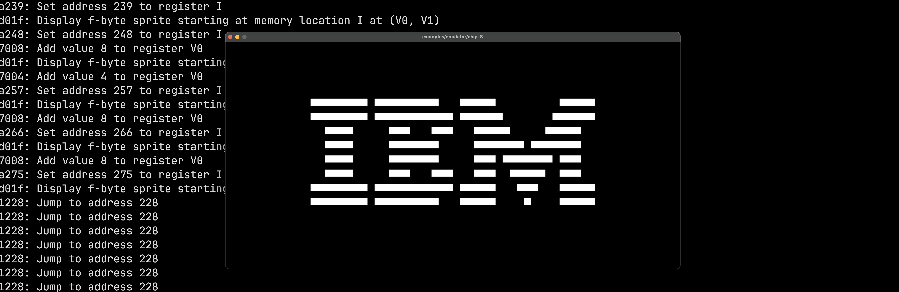
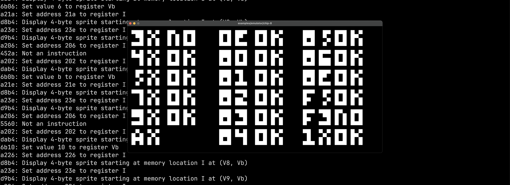

# Goal of project

Create a fully functional CHIP-8 emulator using C and the SDL3 library

# CHANGELOG

## 0.0.1

Add support of all opcodes for running basic IBM program:

Also add partial support of [test rom](https://github.com/corax89/chip8-test-rom):

