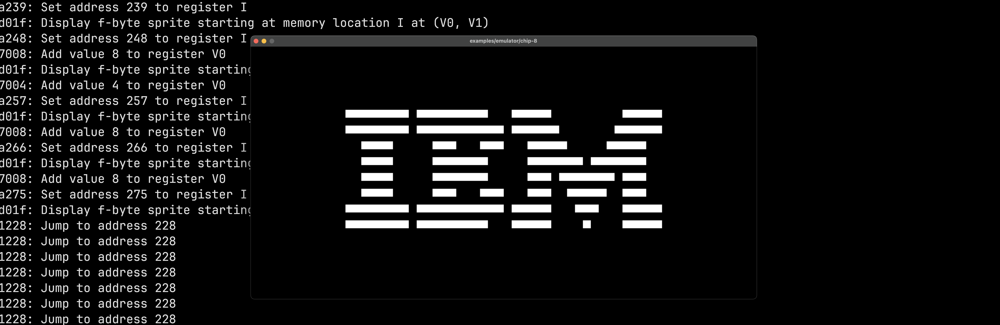
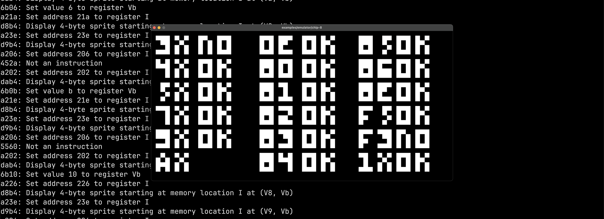

# Goal of project

Create a fully functional CHIP-8 emulator using C and the SDL3 library

# CHANGELOG

## 0.0.4

Fix 8x.. opcodes.

Now, [Flags test](https://github.com/Timendus/chip8-test-suite/tree/main?tab=readme-ov-file#flags-test) is supported:

## 0.0.3

- Add support of FX33, FX55, FX65, ....
- Fix bugs with existed opcodes.

Now, [Corax+ opcode test](https://github.com/Timendus/chip8-test-suite/tree/main#corax-opcode-test) is supported:

## 0.0.2

Add support of few new opcodes - finished 8xyN, and some single opcodes from other categories.

More ROMs are supported now!

## 0.0.1

Add support of all opcodes for running basic IBM program:

Also add partial support of [test rom](https://github.com/corax89/chip8-test-rom):

