# CHIPS —  CHIP-8 emulator

<p align="center">
  <br>
  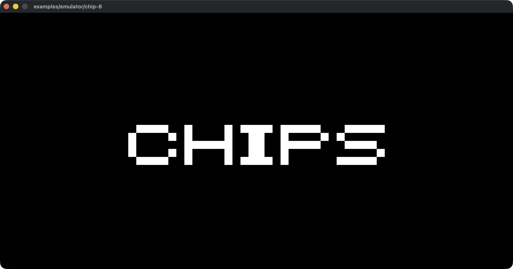
  <br><br>
</p>

## Goal of project

Create a fully functional CHIP-8 emulator using C and SDL3, completely written from scratch without any AI code.

## OS support

At present, functionality has been verified on the following systems:

- macOS 26.3.1.
- Xubuntu 24.04.4 LTS.

## Dependencies

- `pkg-config`
- `SDL3`
- `clang` or `gcc`

## How to compile

### Debug build

``` shell
make
# or
make debug
```

### Release build (with optimizations)

``` shell
make release
```

## How to run

``` shell
./chips -r path-to-rom.ch8   # or any other extension with ROM binary data
```

## What is currently implemented

### Emulator passes all the popular tests

[CHIP-8 splash screen](https://github.com/Timendus/chip8-test-suite#chip-8-splash-screen)

<p align="center">
  <br>
  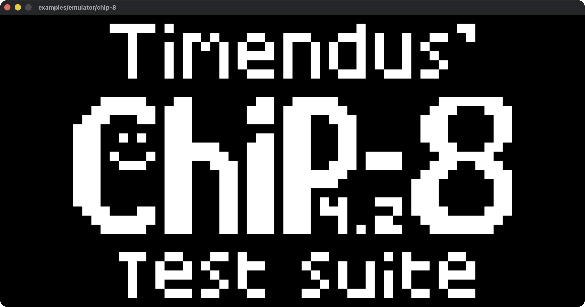
  <br><br>
</p>

[IBM logo](https://github.com/Timendus/chip8-test-suite#ibm-logo)

<p align="center">
  <br>
  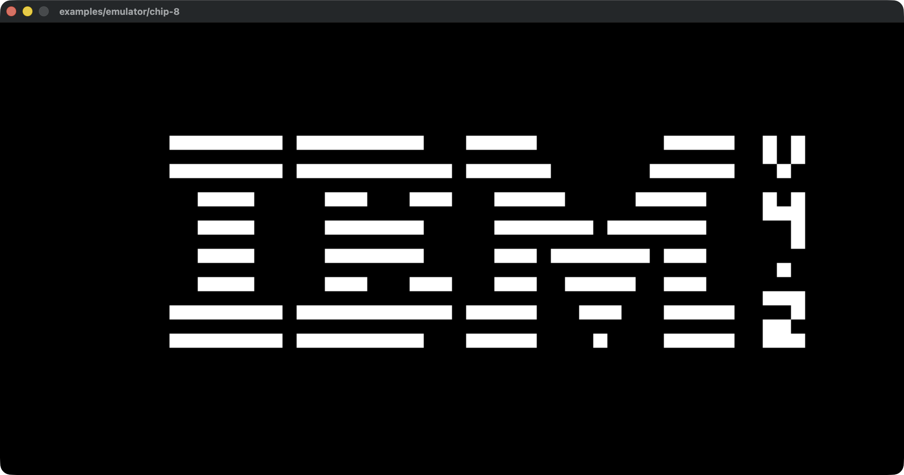
  <br><br>
</p>

[Corax+ opcode test](https://github.com/Timendus/chip8-test-suite#corax-opcode-test)

<p align="center">
  <br>
  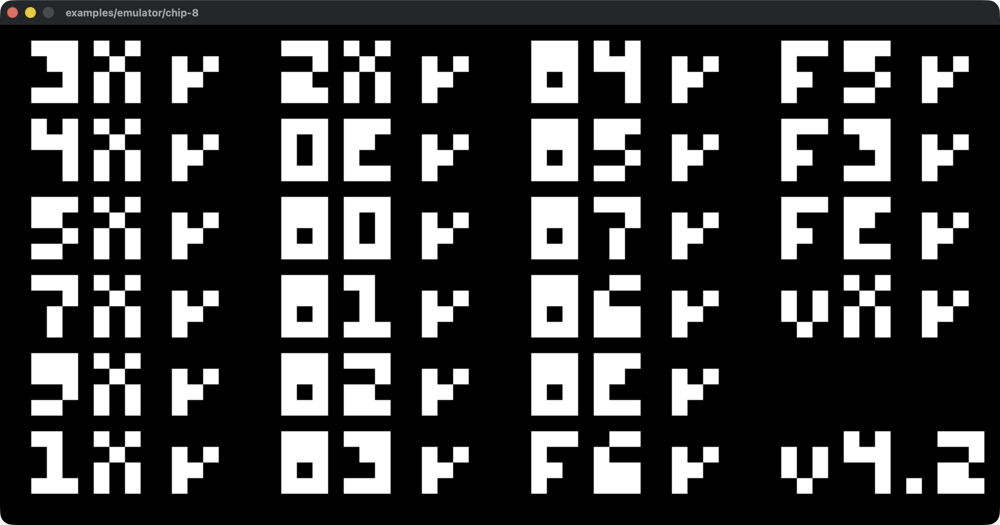
  <br><br>
</p>

[Flags test](https://github.com/Timendus/chip8-test-suite#flags-test)

<p align="center">
  <br>
  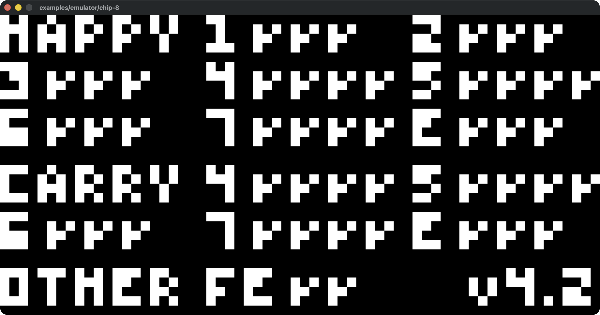
  <br><br>
</p>

[Quirks test](https://github.com/Timendus/chip8-test-suite#quirks-test)

<p align="center">
  <br>
  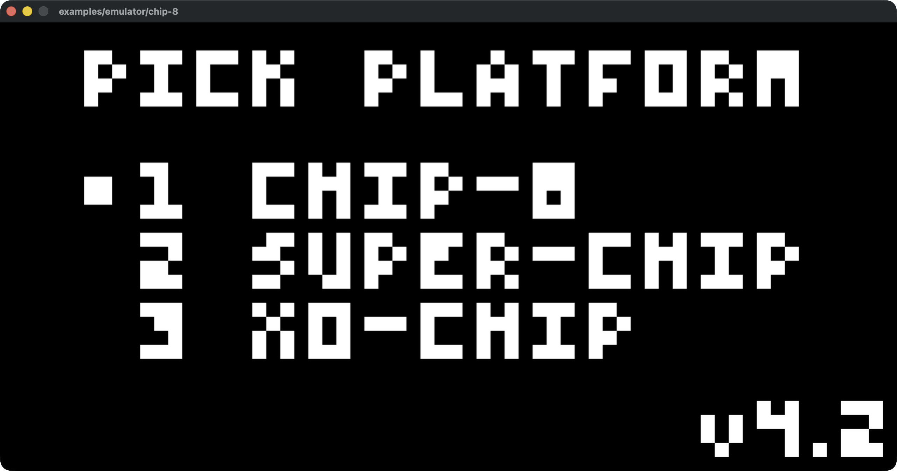
  <br><br>
</p>

<p align="center">
  <br>
  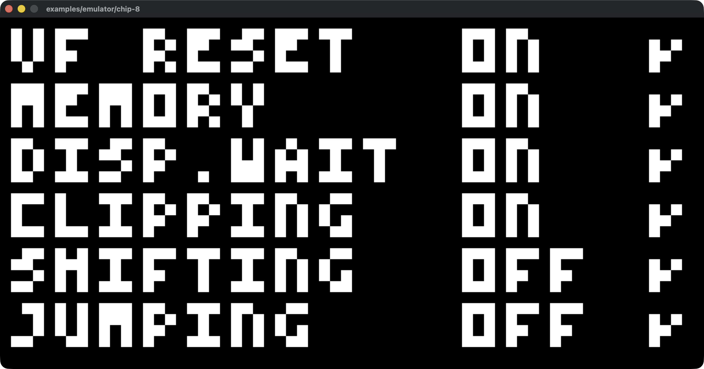
  <br><br>
</p>

[Keypad test](https://github.com/Timendus/chip8-test-suite#keypad-test)

<p align="center">
  <br>
  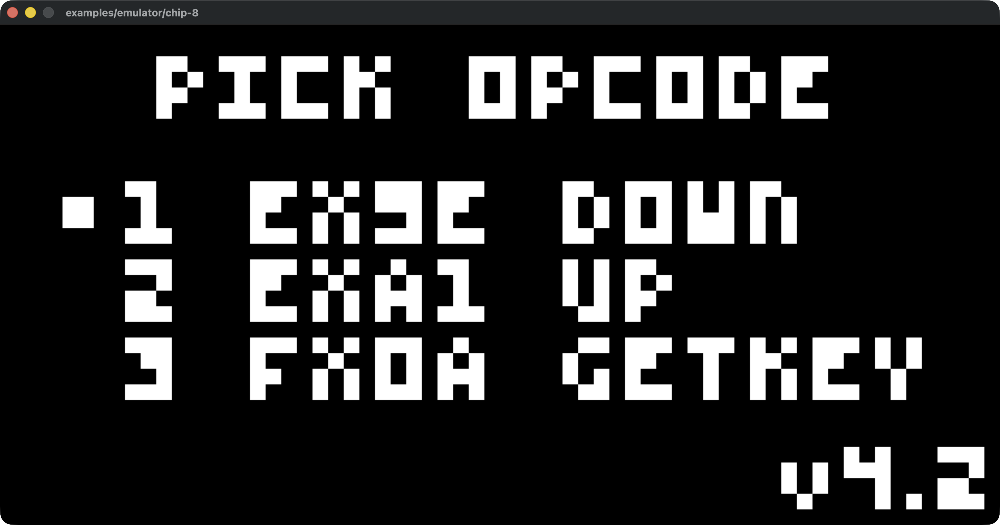
  <br><br>
</p>

<p align="center">
  <br>
  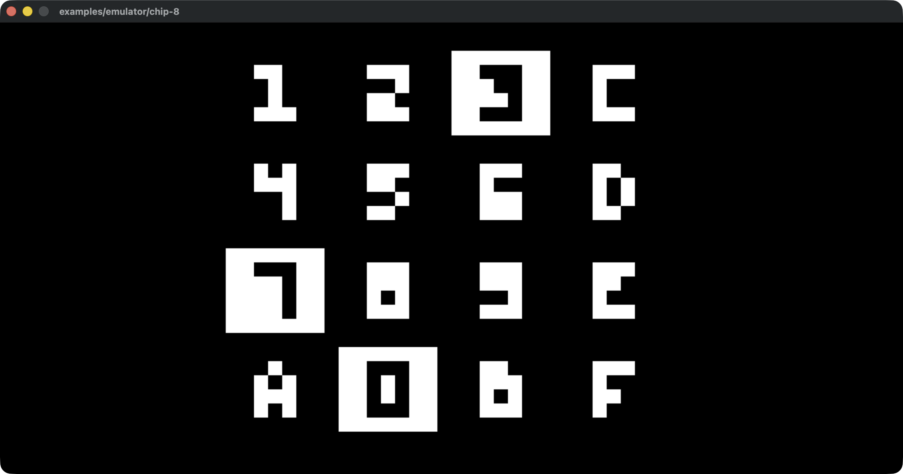
  <br><br>
</p>

<p align="center">
  <br>
  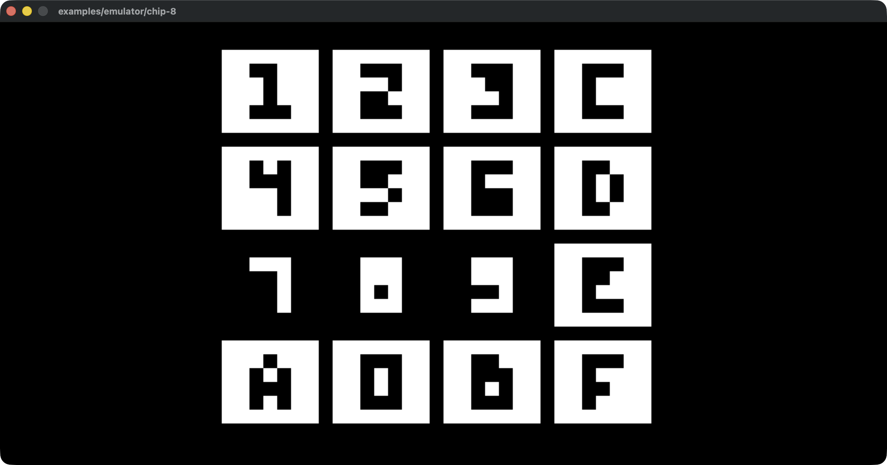
  <br><br>
</p>

<p align="center">
  <br>
  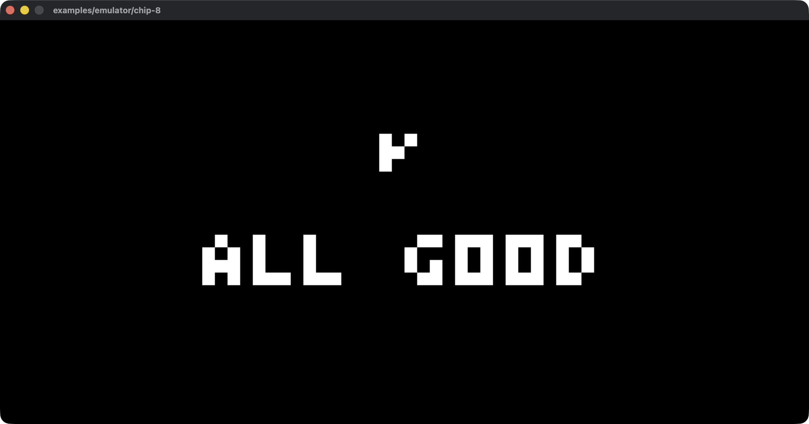
  <br><br>
</p>

[Beep test](https://github.com/Timendus/chip8-test-suite#beep-test)

<p align="center">
  <br>
  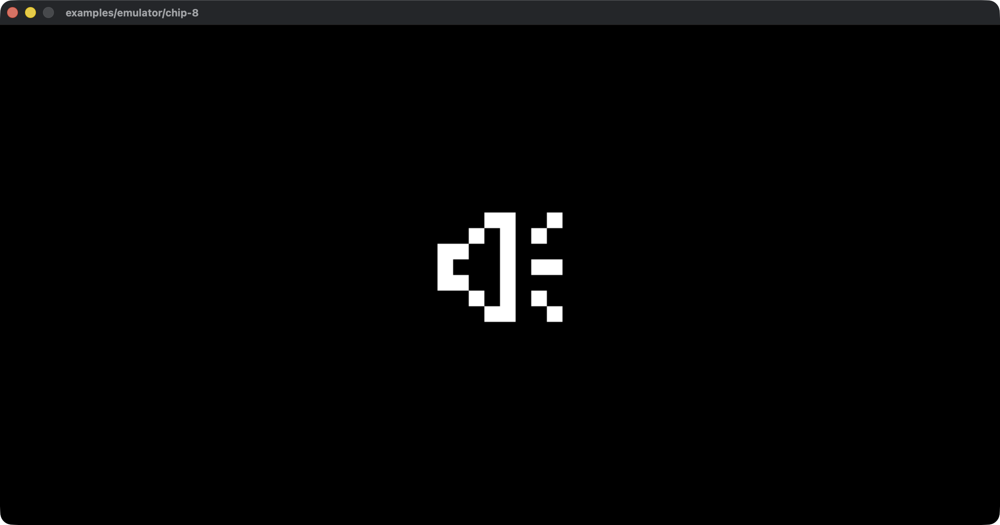
  <br><br>
</p>

### CLI options

Debug mode (info about each executed instruction)

``` shell
./chips -r path-to-rom.ch8 -d
```

<p align="center">
  <br>
  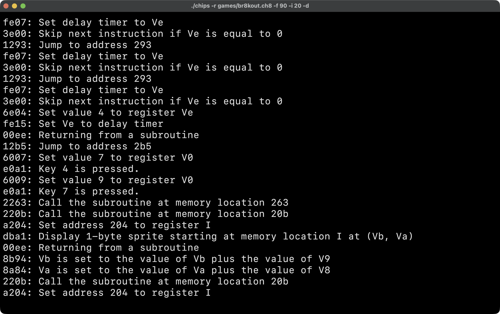
  <br><br>
</p>

Customize IPF (instructions per frame) and FPS (frames per second)

``` shell
./chips -r path-to-rom.ch8 -f 90 -i 30
```

## Links

- [CHANGELOG](docs/CHANGELOG.md)
- [SDL3](https://github.com/libsdl-org/SDL)
- [Guide to making a CHIP-8 emulator](https://tobiasvl.github.io/blog/write-a-chip-8-emulator/#00ee-and-2nnn-subroutines)
- [Cowgod's Chip-8 Technical Reference v1.0](http://devernay.free.fr/hacks/chip8/C8TECH10.HTM#Dxyn)
- [Octo](https://johnearnest.github.io/Octo/)
- [CHIP-8 test suite](https://github.com/Timendus/chip8-test-suite)
- [Chip-8 on the COSMAC VIP: Drawing Sprites](https://laurencescotford.net/2020/07/19/chip-8-on-the-cosmac-vip-drawing-sprites/)
